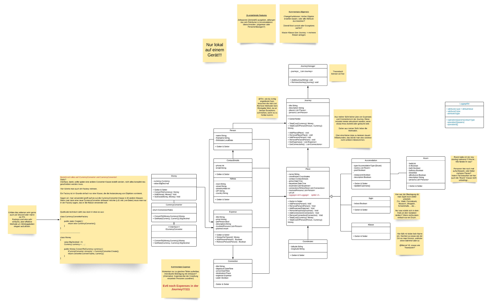

   
       

# TravelBuddy

## Teammitglieder

Franziska Schmidt, Frieder Ullmann, Marcel van der Heide, Tim Vogel

## Beschreibung

TravelBuddy ist ein Planungstool und Begleiter für die nächste Reise.
In einer Übersicht wird geordnet dargestellt, wann eine Aktivität stattfindet, wo und was sie kostet, sowohl Gesamt und für jede Person einzeln.

## Klassendiagramm

# Ausgangssituation

## Musskriterien

Der TravelBuddy kann folgende Kriterien darstellen:
* Orte (geografisch)
* Fahrten (Bahn, Bus, Flugzeug)
* Personen (Reisende, aktuell nur als Liste)
* Kosten (gesamt, pro Person, in einer bestimmten Währung)
* Sehenswürdigkeiten
* Unterkunft
* Reisedatum

## Wunschkriterien

* Wetter
* Restaurants
* Packliste
* Abstimmen

## Zusatzkriterien

* CalDav

## Abgrenzungskriterien

## Aktuere/Stakeholder

### Aktuere
 Aktuell nur auf einem Gerät, somit Local Admin

### Stakeholder

Reisende, Planen einer Reise, Tourenveranstalter, Reiseführer (besseres zeigen, wo man hin möchte oder im Nachhinein zum darstellen wo man war)