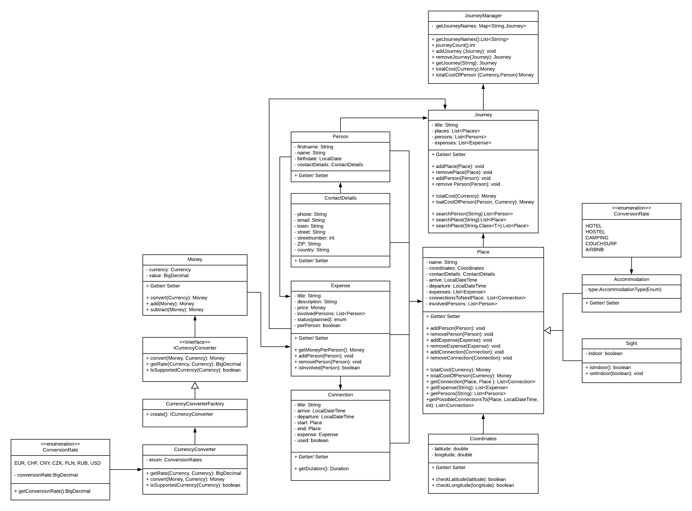

   
       

# TravelBuddy

## Teammitglieder

Franziska Schmidt, Frieder Ullmann, Marcel van der Heide, Tim Vogel

## Beschreibung

TravelBuddy ist ein Planungstool und Begleiter für die nächste Reise.
In einer Übersicht wird geordnet dargestellt, wann eine Aktivität stattfindet, wo und was sie kostet, sowohl Gesamt und für jede Person einzeln.

## Klassendiagramm

# Ausgangssituation

## Musskriterien

Der TravelBuddy kann folgende Kriterien darstellen:
 
* Fahrten (Bahn, Bus, Flugzeug)
* Personen (Reisende, aktuell nur als Liste)
* Orte (geografisch)
* Sehenswürdigkeiten
* Unterkünfte
* Reisedatum

## Wunschkriterien

* Kosten (gesamt, pro Person, in einer bestimmten Währung)
* Restaurants
* Wetter

## Zusatzkriterien

* CalDav

## Abgrenzungskriterien

* Oberfläche (GUI)
* Datenbank
* Input/Output  

## Aktuere/Stakeholder

### Aktuere
 Aktuell nur auf einem Gerät, somit Local Admin.
 Dies wird sich in einer weiteren Version ändern.

### Stakeholder

Reisende, Planen einer Reise, Tourenveranstalter, Reiseführer (besseres zeigen, wo man hin möchte oder im Nachhinein zum darstellen wo man war)  
Als Reiseveranstallter, gibt dir TravelBuddy die Möglichkeit, deinen Gästen die Route und interessante Sehenswürdigkeiten in der Nähe vorzuschlagen. 
In der nächsten Version wird eine verknüpfung mit API's und unserer groß gefüllten DB, noch mehr Funktionen, wie die Verknüpfung mit Maps und Wetter, sowie viele weitere Standorte und Empfelungen beinhalten.
Als Privatanwender ist es möglich die Kosten übersichlich zu halten, die Ausgaben können pro Person oder Gesamt dargestellt werden.

### Verwendete Tools
    - IntelliJ Java 13.01
    - JUnit5.4.2, Maven, JavaDoc
    - Versionskontrollsystem: GitLab
    - Kommunikation: Discord und Signal